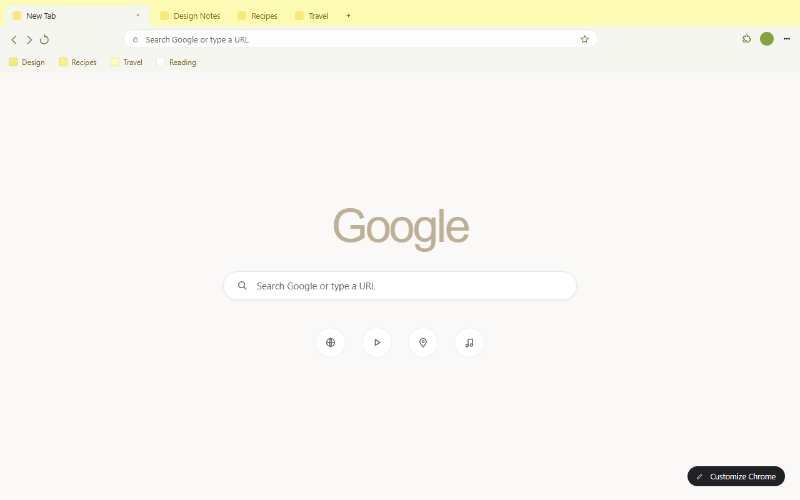
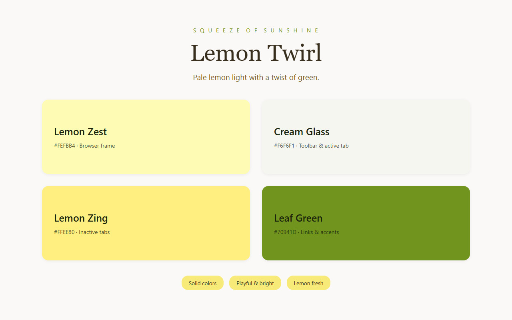

<p align="center">
  
</p>

<h1 align="center">Lemon Twirl Theme</h1>

<p align="center">A playful Chrome theme in pale lemon, cream, and leaf green.</p>

<p align="center">
  
  
  
</p>

## About

Lemon Twirl Theme recolors the browser in a bright lemon palette. A pale lemon
frame sits above a soft cream toolbar and sunlit yellow tabs, with a single
leaf-green accent marking links and new-tab details. Every layer is a flat,
single solid color, so the window stays crisp, light, and easy to read.

## Preview





## Color Palette

| Token | Hex | Usage |
|-------|-----|-------|
| Pale Lemon | `#FEFBB4` | Browser frame |
| Cream Glass | `#F6F6F1` | Toolbar, bookmark bar, active tab |
| Lemon Zing | `#FFEE80` | Inactive tabs, buttons |
| Leaf Green | `#70941D` | Links, new-tab accents |
| Deep Bark | `#392F1E` | Tab and toolbar text |
| Warm Olive | `#767214` | Inactive tab text |
| Soft White | `#FAF9F7` | New-tab page background |

## Features

- Lemon-contrast palette: sunlit yellows for the frame and tabs, cream for the toolbar.
- Flat solid colors on every layer, so nothing competes with page content.
- Tuned text contrast for tab titles, bookmark labels, and address-bar text.
- Leaf-green accent for links and new-tab details.
- Pure theme: colors and tints only, nothing runs inside the page.

## Install

### From Chrome Web Store

Search for **Lemon Twirl Theme** in the Chrome Web Store and install it.

### From source (unpacked)

1. Download or clone this repository.
2. Open Chrome and go to `chrome://extensions`.
3. Turn on **Developer mode** (top right).
4. Click **Load unpacked** and select this folder.

## Files

| File | Description |
|------|-------------|
| `manifest.json` | Chrome theme manifest (MV3) with the inline `theme` config |
| `logo/logo.png` | Store and profile icon (128×128) |
| `store-assets/screenshots/en/` | Store listing screenshots (1280×800) |
| `store-assets/promo/` | Promo tiles (440×280 and 1400×560) |
| `store-assets/store-description.txt` | Store listing description (English) |
| `scripts/generate-logo.py` | Redraws `logo/logo.png`; `--options` renders the candidates |
| `scripts/generate-store-assets.py` | Renders screenshots and promo tiles from `manifest.json` |
| `scripts/package.py` | Builds the Web Store ZIP and copies it to the release folder |

## Development

Every asset is generated from `manifest.json`, so the artwork follows the theme
colors automatically.

```bash
python3 scripts/generate-logo.py            # logo/logo.png
python3 scripts/generate-store-assets.py    # screenshots + promo tiles
python3 scripts/package.py --force          # dist ZIP + release copy
```

## License

Non-Commercial License — see [LICENSE](LICENSE). Personal use is permitted;
commercial use requires permission from the author.
